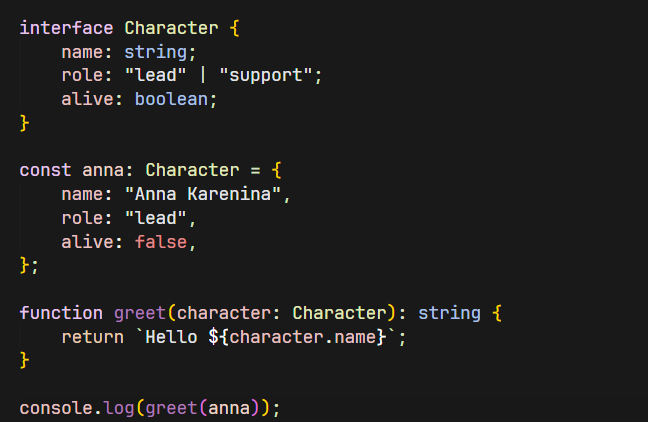

# Anna Karenina Theme

A dark Visual Studio Code theme inspired by *Anna Karenina* by Leo Tolstoy.

Designed with a subdued, literary aesthetic, the theme emphasizes readability while drawing inspiration from the atmosphere of Imperial Russia—candlelit interiors, winter landscapes, and quiet elegance.

## Preview



## Installation

### From the Marketplace

Search for **Anna Karenina Theme** in the Extensions view.

### From a VSIX

```bash
code --install-extension anna-karenina-theme-0.0.1.vsix
```

## Features

- Carefully balanced syntax highlighting
- Comfortable contrast for extended coding sessions
- Consistent coloring across common programming languages
- Minimal interface distractions

## Development

Clone the repository and install dependencies.

```bash
npm install
```

Launch the Extension Development Host.

```bash
F5
```

Package the extension.

```bash
vsce package
```

> Then install the vsix file

## Inspiration

The theme takes its inspiration from *Anna Karenina*, aiming to capture the novel's contrast between warmth and isolation through a restrained visual style suited for everyday development.
